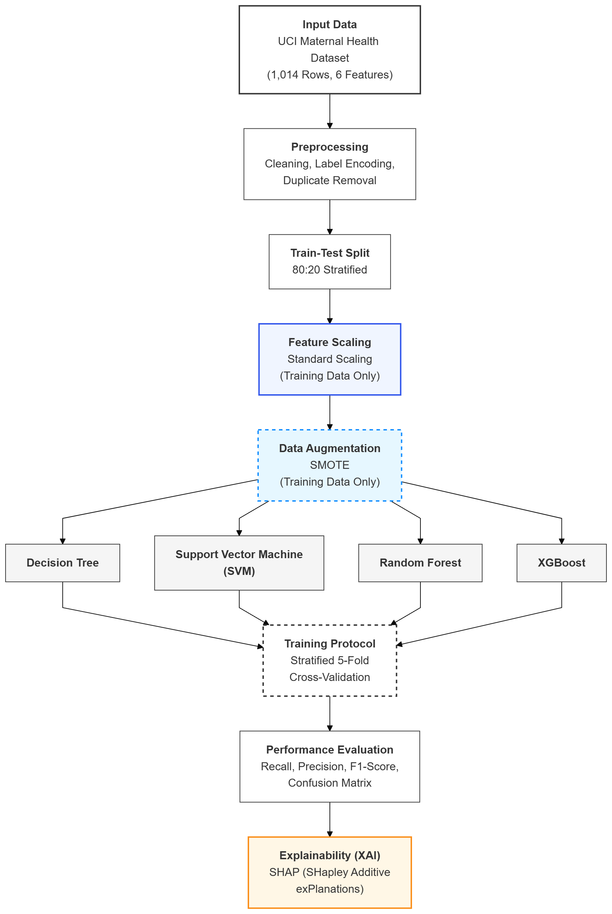

# IoT-Based Maternal Health Risk Stratification: A Comparative Analysis of Machine Learning Models for Classification

## Overview

This repository contains the implementation of a machine learning scheme for maternal health risk classification (Low, Mid, High) using the UCI Maternal Health Dataset. This implementation follows the methodology described in an accompanying research paper and ensures reproducibility of results.

The study focuses on:

* Preventing data leakage through proper preprocessing
* Handling class imbalance using SMOTE
* Comparing multiple ML models
* Enhancing interpretability using SHAP

---

## Methodology

<p align="center">
  
</p>

---

## Results

XGBoost achieved the best performance with:

* Accuracy: 63.74%
* Recall: 63.74%

---

## XAI for Explainability

SHAP analysis highlights:

* Blood Glucose (BS)
* Body Temperature
* Systolic Blood Pressure

as the most influential features in risk prediction.

---

## How to Run

```bash
git clone https://github.com/manaal-m/Maternal-Health-Risk-Stratification.git
cd Maternal-Health-Risk-Stratification
pip install -r requirements.txt
python src/model_training.py
```
Or you can download the repository as a ZIP file from GitHub and extract it.

---

## Dataset

[UCI Maternal Health Risk Dataset](https://archive.ics.uci.edu/dataset/863/maternal+health+risk)

---

## License

MIT License

